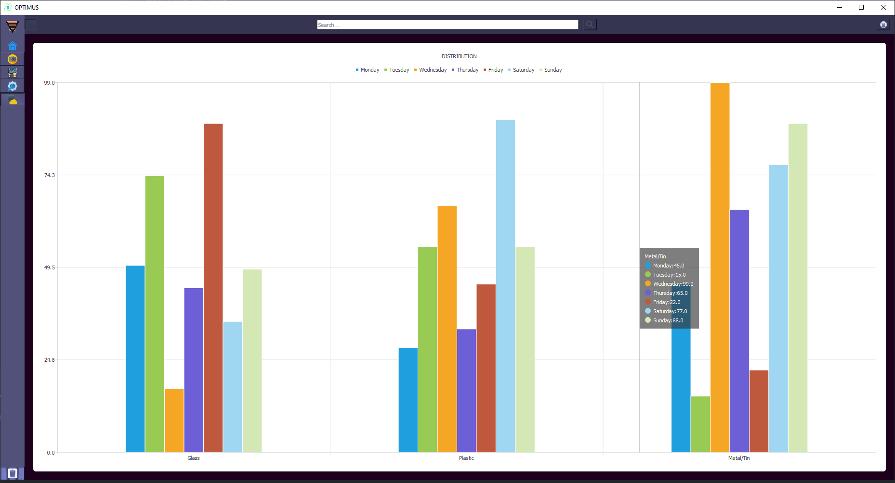

# ComputerVision

It is the completed version of the image processing page of the interface where I carry out computer vision and artificial intelligence projects.

In the continuation of the interface, integration of artificial intelligence projects such as object classification, recognition and segmentation and system communications will be carried out.

- 🚀

# User Interface 

It is the homepage of the interface developed for the integrated operation of the waste separation system with computer vision and artificial intelligence.

- `Home PAGE` - The page where the camera *tracking* and *detection* processes are followed.
- `Image Processing Analysis` - The page where *dimensional measurement and image processing analyzes* are made on the detected products.
- `Signal Flow System` - The page where the connection status checks of the camera and other devices are made.
- `Settings` - Settings page, the page where the connection settings are changed.
- `Data Visualization` - Data page, daily tracking and reporting of detected ones.


To run, e.g.
```
Soon the system working exe will be loaded.
```


- `Home PAGE`
<br>
<br>
<p align="center">
    
</p>

- `Image Processing Analysis Page` 
<br>
<br>
<p align="center">
    
</p>

- `Signal Flow System` 
<br>
<br>
<p align="center">
    
</p>
- `Settings`
<br>
<br>
<p align="center">
    
</p>

- `Data Visualization` 
<br>
<br>
<p align="center">
    
</p>
 
- `Data Visualization` 
<br>
<br>
<p align="center">
    
</p>
